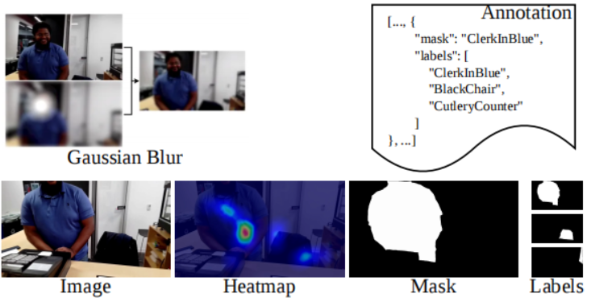

# SalEgo
SalEgo contains 29 video sequences, for each lasting 20 seconds and containing 600 frames. The dataset undergo meticulous eye-tracking fixation point collection and annotation. Moreover, these videos are carefully selected to cover a diverse range of scenes and object categories, with densely annotated pixel-accurate ground truths (GT) for each frame. A distinctive feature of SalEgo is its inclusion of ground truth annotations for several objects that are not salient in the current frame but may become salient. Additionally, corresponding data label files are provided for each frame to indicate these relationships.

# Download
SalEgo dataset. [Baidu Pan](https://pan.baidu.com/s/10G_trhYnt9-5KuPWMZBVtA)(fetch code: ego4)
# Method
Coming soon.
